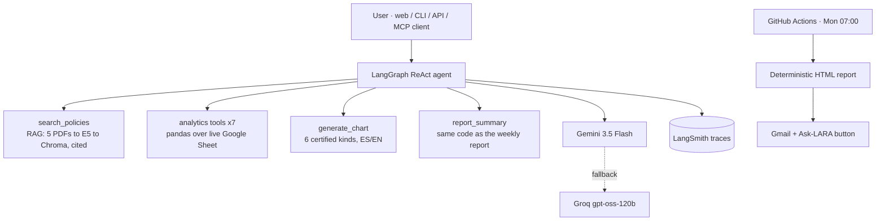

# LARA — Intelligent Internal Support Agent | Latram Shop

[](https://huggingface.co/spaces/marianunez-data/lara-latram-support)
[-2f855a)](data/eval/results_20260720_0851.md)
[](https://www.python.org)

**Try it live:** https://marianunez-data-lara-latram-support.hf.space

Bilingual (ES/EN) AI agent for internal support at Latram Shop (fictional
LatAm retailer): answers policy questions **with citations**, analyzes
**live sales data** from Google Sheets, generates localized **charts**,
explains and emails an interactive **weekly BI report**, and runs deployed
on Hugging Face — all on **$0/month infrastructure**.

**Stack:** LangGraph ReAct · Gemini 3.5 Flash + Groq fallback ·
multilingual-E5 + Chroma RAG · FastAPI + Gradio · LangSmith · GitHub Actions
· MCP server.

---

## Architecture



**Design principles**

- **Code calculates, the LLM narrates** — every figure comes from pandas, so
  a number cannot be hallucinated; the model only phrases the answer.
- **Stateless recall** — past report weeks are *recomputed* from source, not
  remembered: unlimited history, zero drift, nothing to invalidate.
- **Single source of truth** — the agent explains the weekly report using
  the report's own functions, so the two can never contradict each other.
- **No arbitrary code execution** — the LLM chooses among fixed,
  parameterized functions; it never runs generated code on the server.
- **Graceful degradation** — if the live data source fails, the agent falls
  back to the bundled snapshot; if the primary LLM fails, the fallback
  provider answers.

## Evaluation (LLM-as-judge)

18 gold questions across 5 categories (policy, data, cross-source,
guardrail, report-explainability), with exact ground truths recomputed from
the dataset and a judge running the same dual-provider stack.

**Latest run: 17/18 PASS (94%)** — full detail in
`data/eval/results_20260720_0851.md`; history of every run is committed in
`data/eval/`, showing the progression 67% → 93% → 94% across
diagnose-and-fix iterations. Runtime ≈ 6 minutes.

The single remaining failure is a stochastic tool-routing miss on the
Spanish report-explainability question — its English twin passes.
Mitigation is documented rather than hidden: forcing tool choice would fix
it at the cost of agent autonomy.

House rule: **deterministic systems get tested, probabilistic systems get
evaluated**. `verify_report.py` recomputes the report's headline figures
through an independent code path (golden check); the agent gets the gold set
and the judge.

## Robustness testing — bugs caught before users could

A controlled **sabotage test** (6 sentinel rows injected into the live
Sheet) woke every dormant alert branch — threshold chips, country
concentration, repeat-product flag — and surfaced three real-world bugs, all
fixed: currency-formatted cells (`$39.99`) breaking numeric parsing; mixed
date formats between imported and hand-typed rows; and a silent-fallback
environment misconfiguration. A fourth bug (`build_index.main` missing) was
caught **in production** by the graceful-error UX, which shows users a
friendly apology and engineers a `detail:` breadcrumb.

A fifth gap was found by using the agent as a real user would: asking for a
*list* of in-transit order IDs had no matching tool, and the agent correctly
refused to invent one — the gap was closed with a deterministic
`list_orders` tool including order aging.

## Production hardening — surviving live platform changes (Jul 2026)

Groq and Gemini deprecated the launch models mid-project (the fallback
masked it; found via 404 forensics) · Gemini 3.x switched to list-content
responses (normalizer added) · Gradio 6.0 removed three kwargs live · HF
moved Docker Spaces to paid plans · the remaining free tier, ZeroGPU,
requires a `@spaces.GPU` function **wired into the Gradio event graph**
(hidden-button contract), forbids CUDA init outside it (CPU pinning plus
probe override), and demands `import spaces` **before** torch · unpinning
`sdk_version` silently changed the runtime to a different Python and broke
the boot, which is why the environment is now pinned explicitly.

Resolved across nine entrypoint iterations, diagnosing runtime state via the
public Spaces API — evidence of operating AI systems against moving
third-party platforms.

## Operations & limits (free tier, honest numbers)

| Dimension | Limit / behavior |
|---|---|
| Concurrency | Gradio queue = 4 simultaneous requests; further users queue |
| Capacity | Gemini free ≈ 250–1,000 req/day, Groq fallback ≈ 14k/day → practical ceiling **≈ 200–500 questions/day** |
| Tokens | ≈ 2–4k tokens per question (ReAct loop + tool results) |
| Latency | 3–10s typical; **first question after cold start: 2–4 min** (index rebuilds — ephemeral disk by design) |
| Sleep | Space sleeps after ~48h idle; any visit wakes it (~1–2 min) |
| Charts | **Fixed catalog of 6 certified kinds** (below) — requests map to the nearest type; the agent never draws arbitrary charts |
| Knowledge base | 5 policy PDFs → chunks of ~800 chars with overlap; Chroma scales to ~1M chunks locally, so the current corpus uses <1% of the ceiling |
| Traces | LangSmith free: 5k traces/month, **14-day retention**; the weekly report reads the last 7 days via API (window always fits), `export_traces.py` archives beyond that |
| Data | Live Sheet cached 60s; loader sanitizes currency symbols and mixed date formats |

**Costs:** the current stack runs at **$0**. At paid scale: ≈
$0.0005–0.001 per question (Flash-class pricing) → 100 questions/day ≈
**$2–3/month**. The heaviest future line item is observability retention,
not tokens.

## Chart catalog — the only visuals the agent draws

| Ask (ES / EN) | Renders |
|---|---|
| "participación por método de pago" / payment share | pie with percentages |
| "ventas por mes" / monthly sales | line trend |
| "ventas por país" / sales by country | bars |
| "top productos" / top products | horizontal bars |
| "devoluciones por razón" / returns by reason | bars |
| "días de entrega" / delivery days | histogram |

Requests outside the catalog get the **nearest certified type** (a "country
pie" renders as bars — also the correct dataviz call at 7 slices).
Extending the menu costs ~10 lines in `charts.py` per new kind.

## Memory, persistence & reliability

**Memory:** stateless by design — each question is independent (help-desk
pattern: cheap, drift-free, auditable). The agent never "remembers" past
reports; it recomputes any week from source, so recall is unlimited within
the data range. Multi-turn session memory is a roadmap item via the
LangGraph **checkpointer** (`MemorySaver` + `thread_id`) — note that
checkpoints and streaming are different concerns: one persists state, the
other streams tokens. **Streaming:** responses are currently blocking; token
streaming is on the roadmap.

**Persistence map:** LangSmith traces 14 days · local `questions.jsonl`
indefinitely per machine · emailed reports indefinitely · `export_traces.py`
cold archive on demand. GitHub stores code only; the Monday runner is
ephemeral and reads LangSmith via API.

**Hallucination — measured, not assumed:** the judged evaluation is the
detector (exact ground truths; guardrails decline out-of-scope questions);
every policy answer carries a citation; every number comes from tools;
`verify_report.py` double-computes the report; and a mandatory
report-routing rule in the system prompt closes the one stochastic miss
observed. Mitigation ladder, in order of cost: prompt rules → forced tool
choice → self-verification → deterministic escape.

## MCP integration

`src/app/mcp_server.py` exposes LARA's tools over the open **Model Context
Protocol**, so Claude Desktop, IDEs or other agents can call
`policy_search`, the analytics suite, `weekly_report_figures` or `chart`
directly. The agent stops being one app and becomes **infrastructure**:
compute and data stay on our side, only results enter the caller's context,
and governance and auditability are preserved.

```bash
python -m src.app.mcp_server     # stdio transport
```

## Maintenance runbook

- **Weekly (5 min):** scan the LangSmith dashboard for latency or error
  spikes; sanity-check the Monday email.
- **Monthly (30 min):** run the evaluation and append the RESULT to the
  history; review `pip list --outdated`.
- **Quarterly:** rotate API keys; re-verify model names against provider
  docs (models get deprecated — this project has the scar tissue).
- **On any provider 404:** list available models via the SDK, check the
  docs, update the environment variable, redeploy.

## Usage recommendations

Internal tool for trained staff rather than a customer-facing bot:
guardrails decline out-of-scope questions, but the tone is
colleague-level. Phrase data questions with explicit periods for auditable
answers. Charts and the report link render inside the chat. API mode
(`POST /ask`, `GET /health`, `GET /report`) is available through the Docker
deployment (see `DEPLOY.md` §7) for integrations such as Slack, n8n or MCP.

## Quickstart

```bash
pip install -r requirements.txt && cp .env.example .env   # add your keys
python -m src.app.build_index          # index the policy PDFs
python -m src.app.cli                  # chat in the terminal
uvicorn src.app.api:app --port 7860    # web UI + API
python -m src.app.weekly_report --dry-run && python -m src.app.verify_report
python -m src.app.evaluate             # judged evaluation (~6 min)
```

## Roadmap

Drive API sync for private sheets · semantic answer cache · multi-turn
session memory · optional LLM-narrated executive summary (grounded in
code-computed figures) · custom React frontend · PDF snapshot attached to
the Monday email · voice layer (STT/TTS) on top of the existing `/ask` API.
