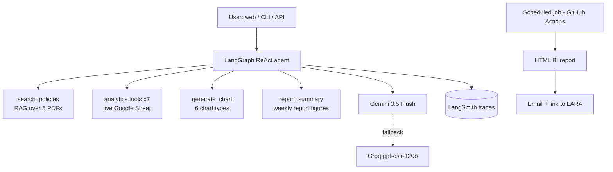

# LARA — Intelligent Internal Support Agent | Latram Shop

[](https://huggingface.co/spaces/marianunez-data/lara-latram-support)
[-2f855a)](data/eval/)
[](https://www.python.org)

**Try it live:** https://marianunez-data-lara-latram-support.hf.space

Bilingual (ES/EN) AI agent for internal support at Latram Shop (fictional
LatAm retailer). It answers policy questions **with citations**, analyzes
**live sales data** from Google Sheets, generates charts, explains and
emails an interactive **weekly BI report**, and runs deployed on Hugging
Face — on free-tier infrastructure.

**Stack:** LangGraph ReAct · Gemini 3.5 Flash + Groq fallback ·
multilingual-E5 + Chroma RAG · FastAPI + Gradio · LangSmith · GitHub Actions.

---

## Architecture



**Design principles**

- **Code calculates, the LLM narrates.** Every figure comes from pandas, so
  a number cannot be hallucinated; the model only phrases the answer.
- **Stateless recall.** Past report weeks are recomputed from source rather
  than remembered: unlimited history, nothing to invalidate.
- **Single source of truth.** The agent explains the weekly report using the
  report's own functions, so the two can never contradict each other.
- **No arbitrary code execution.** The LLM chooses among fixed,
  parameterized functions; it never runs generated code on the server.
- **Graceful degradation.** If the live data source fails, the agent falls
  back to a bundled snapshot; if the primary LLM fails, the fallback
  provider answers.

## Tools

Ten tools, grouped by what they touch. The agent chooses among them; it never
writes or runs code of its own.

| Group | Tool | Does |
|---|---|---|
| Knowledge | `search_policies` | RAG over the 5 policy PDFs, returns passages with their source and section |
| Analytics | `sales_overview` | revenue, orders, AOV, cancellations and returns for a period |
| | `top_products` | ranking by revenue or units |
| | `sales_breakdown` | by country, category, product, payment method, zone or month |
| | `returns_report` | requests by reason and status, with rates |
| | `late_return_requests` | requests filed outside the policy window, with average delay |
| | `order_lookup` | full record of a single order |
| | `list_orders` | orders by status and country, with aging in days |
| Visual | `generate_chart` | six certified chart types, localized ES/EN |
| Reporting | `report_summary` | weekly report figures with their formulas |

The same ten are exposed over MCP (see below), so an external client gets
exactly the surface the agent has — no more.

## Evaluation (LLM-as-judge)

18 gold questions across 5 categories — policy, data, cross-source,
guardrail and report-explainability — with ground truths recomputed from the
dataset and a judge running the same dual-provider stack.

**Latest run: 17/18 PASS (94%).** Every run is committed in `data/eval/`,
showing the progression 67% → 93% → 94% across diagnose-and-fix iterations.
A full run takes about 6 minutes.

The remaining failure is a tool-routing miss on the Spanish
report-explainability question; its English twin passes. It is documented
rather than hidden: forcing tool choice would fix it at the cost of agent
autonomy.

House rule: **deterministic systems get tested, probabilistic systems get
evaluated.** The report is pure pandas, so it gets a *double computation*:
`verify_report.py` recalculates revenue, orders, cancellations and return
requests through a second, independently written code path and asserts both
agree — a silent formula bug would have to exist twice, identically. The
agent, being probabilistic, gets the gold set and a judge instead.

## Robustness testing

A controlled **sabotage test** — six sentinel rows injected into the live
Sheet — triggered every dormant alert branch (threshold chips, country
concentration, repeat-product flag) and surfaced three real bugs, all fixed:
currency-formatted cells (`$39.99`) breaking numeric parsing, mixed date
formats between imported and hand-typed rows, and a silent-fallback
environment misconfiguration. A sixth was found by re-testing the loader against
hand-typed rows: the same mixed-date-format bug had survived in
`late_return_requests`, a function the first sweep missed.

A fourth bug was caught in production by the error-handling UX, which shows
users an apology and engineers a `detail:` breadcrumb. A fifth gap appeared
while using the agent as a real user: asking for a *list* of in-transit
order IDs had no matching tool, and the agent correctly refused to invent
one — closed with a deterministic `list_orders` tool that includes order
aging.

## Guardrails

Eight controls, each answering a specific failure mode:

| Guardrail | Failure it prevents | Where |
|---|---|---|
| Answer only from retrieved passages, with citation | invented policy | system prompt + `search_policies` |
| Explicit refusal when the answer is not in the corpus | confident fabrication | system prompt; covered by gold questions |
| Out-of-scope decline (e.g. financial advice) | acting outside its remit | system prompt; covered by gold questions |
| Fixed, parameterized tools — no generated code executed | arbitrary code execution on the server | `analytics.py` design |
| Read-only data access | corrupting the source of truth | tools never write |
| Mandatory routing to `report_summary` for report questions | recomputing report metrics a different way | system prompt rule |
| Independent recomputation before the report is emailed | a formula bug shipping to stakeholders | `verify_report.py` gate in CI |
| Provider fallback with bounded retries and timeouts | one vendor outage taking the agent down | `build_llm()` |

Errors surfaced to users are friendly; the technical detail stays as a
breadcrumb for whoever debugs it.

## Engineering notes

Built against fast-moving dependencies: both LLM providers deprecated the
launch models mid-project (the fallback masked it until a 404 forensic
found it), Gemini switched to list-content responses, Gradio shipped a
breaking major version, and the free Spaces tier changed its hardware and
runtime contract. The deployment now pins its SDK and Python versions
explicitly, and runtime failures are diagnosed through the public Spaces
API rather than by guesswork.

## Operations & limits

| Dimension | Value | Source |
|---|---|---|
| Concurrency | 4 simultaneous requests, others queue | configured in code (`queue(default_concurrency_limit=4)`) |
| Latency | ~6s median, up to ~22s on tool-heavy questions | measured across evaluation runs (`data/eval/`) |
| Cold start | 2–4 min for the first question | observed: the vector index rebuilds on ephemeral disk |
| Sleep | pauses after ~48h idle, wakes on visit | Hugging Face free-tier behavior |
| Tokens | ~11k per question (median ~10.5k, range 1.5k–49k) | measured: LangSmith trace table and the local `questions.jsonl` log |
| Cost per question | ≈ $0.0007 | measured: LangSmith cost column (100 questions/day ≈ $2/month) |
| Daily capacity | bounded by provider free tiers; the fallback absorbs bursts | provider quotas — check current docs before quoting |
| Charts | 6 chart types (below) | code — the agent never draws arbitrary charts |
| Knowledge base | 5 PDFs → 252 chunks of 1,000 chars with 150 overlap (15%) | `CHUNK_SIZE` / `CHUNK_OVERLAP` in `config.py`; count from the Chroma collection |
| Traces | 5k/month, 14-day retention | LangSmith free plan |

**Costs.** The current stack runs at no cost. Token spend scales with
traffic, not with data volume: adding policy PDFs or rows to the sheet
changes disk and RAM, not the bill. At sustained use the first paid line
item is trace retention in the observability tool, since the model itself
is fractions of a cent per question.

## Chart catalog

The agent draws from a fixed set of chart types rather than generating
visuals freely, which keeps output predictable and reviewable:

| Ask (ES / EN) | Renders |
|---|---|
| participación por método de pago / payment share | pie with percentages |
| ventas por mes / monthly sales | line trend |
| ventas por país / sales by country | bars |
| top productos / top products | horizontal bars |
| devoluciones por razón / returns by reason | bars |
| días de entrega / delivery days | histogram |

Anything outside the catalog maps to the closest available type — a
"country pie" comes back as bars, which is also the better call at seven
categories. New chart types are added in `charts.py`.

## Memory & persistence

The agent is **stateless by design**: each question is independent, which
suits a help-desk workload and keeps answers auditable. It does not
remember past reports — it recomputes any week from source, so recall is
unlimited within the data range.

A **trace** is the full record of one run — the question, every LLM call,
every tool call with its arguments and output, latency and token counts,
and the final answer. Traces are what make an answer reconstructable after
the fact. They are captured in LangSmith and, independently, in a local
JSONL log so the project is not locked to one vendor.

Where things persist: LangSmith traces for 14 days · a local
`questions.jsonl` per machine · emailed reports indefinitely ·
`export_traces.py` for a cold archive beyond the retention window. GitHub
stores code only; the scheduled runner is ephemeral and reads LangSmith
through its API.

**On hallucination.** The judged evaluation is the detector: exact ground
truths, guardrail questions that must be declined, and citations on every
policy answer. Numbers always come from tools, `verify_report.py`
double-computes the report before it is sent, and a routing rule in the
system prompt closes the one stochastic miss observed. The mitigation
ladder, in order of cost: prompt rules → forced tool choice →
self-verification → deterministic escape.

## Weekly report automation

`.github/workflows/weekly_report.yml` renders the closed week from the live
source, verifies every headline figure through an independent code path, and
emails the interactive report with a link back to the deployed agent. If the
verification step fails, the email is not sent.

The schedule is a single cron line — any day, any hour — and the recipient is
configuration, not code. **In this public deployment the job is left
disabled:** a portfolio demo has no team to email, and scheduling mail to a
personal inbox is not a behaviour worth shipping. Runs shown in the write-up
were triggered manually with `python -m src.app.weekly_report`.

## MCP server

`src/app/mcp_server.py` exposes the same ten tools over the open **Model
Context Protocol**, so Claude Desktop, an IDE or another agent can call
`policy_search`, the analytics suite, `weekly_report_figures` or `chart`
directly. LARA stops being one app and becomes infrastructure: compute and
data stay on this side, only results enter the caller's context, and the
audit trail is preserved.

```bash
python -m src.app.mcp_server   # stdio transport
python test_mcp.py             # smoke test: lists the tools and calls two
```

Client config (Claude Desktop `claude_desktop_config.json`):

```json
{"mcpServers": {"lara": {
  "command": "/ABSOLUTE/PATH/.venv/bin/python",
  "args": ["-m", "src.app.mcp_server"],
  "cwd": "/ABSOLUTE/PATH/Lara-agent"}}}
```

Transport is stdio, so the client runs on the same machine. Remote access
would need the HTTP transport plus authentication — deliberately out of scope.

## Maintenance runbook

- **Weekly:** scan the LangSmith dashboard for latency or error spikes;
  sanity-check the report email.
- **Monthly:** run `python -m src.app.evaluate` and commit the result to the
  history; review `pip list --outdated`.
- **Quarterly:** rotate API keys; re-verify model names against provider
  docs — models get deprecated, and this project has the scar tissue.
- **On any provider 404:** list available models via the SDK, check the
  docs, update the environment variable, redeploy.

## Usage notes

Internal tool for trained staff rather than a customer-facing bot:
guardrails decline out-of-scope questions, but the tone is colleague-level.
Data questions with explicit date ranges give the most auditable answers.
API mode (`POST /ask`, `GET /health`, `GET /report`) is available through
the container deployment described in `DEPLOY.md`, for integrations such as
Slack or workflow automation tools.

## Quickstart

```bash
pip install -r requirements.txt && cp .env.example .env   # add your keys
python -m src.app.build_index          # index the policy PDFs
python -m src.app.cli                  # chat in the terminal
uvicorn src.app.api:app --port 7860    # web UI + API
python -m src.app.weekly_report --dry-run && python -m src.app.verify_report
python -m src.app.evaluate             # judged evaluation (~6 min)
```

## Roadmap

Semantic clustering of logged questions (today the ranking counts exact
strings, so near-duplicates appear twice) · publishing the generated report
to a static host on each run so the emailed link never lags · Drive API sync for private sheets · semantic answer cache ·
multi-turn session memory · optional LLM-narrated executive summary
grounded in code-computed figures · custom frontend · PDF snapshot attached
to the report email · voice layer (STT/TTS) on top of the existing `/ask`
API.
